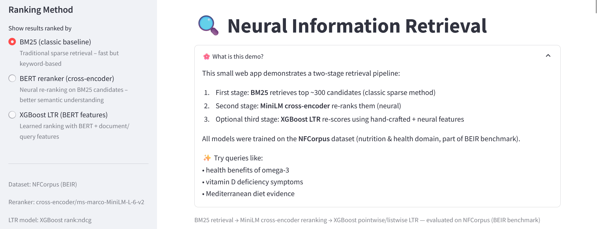
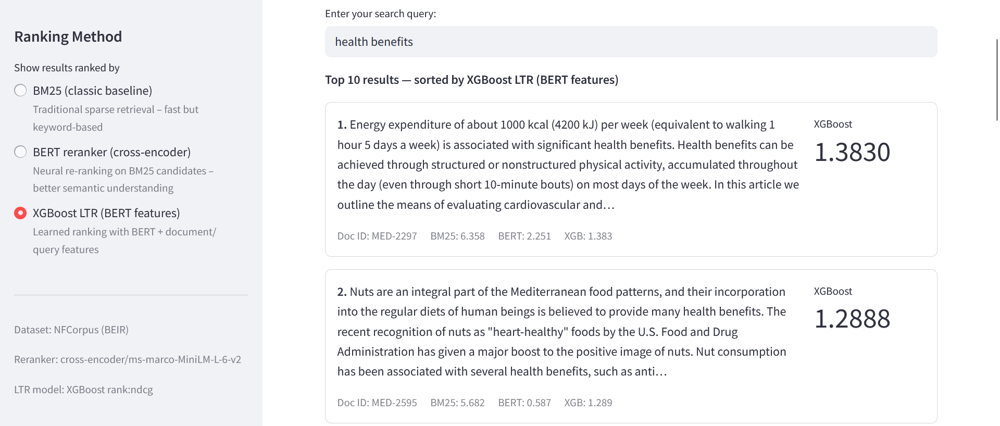

# Neural Re-ranking & Learning-to-Rank on NFCorpus

**BM25 → MiniLM cross-encoder → XGBoost LTR**  
Modern two/three-stage retrieval pipeline – end-to-end demo included

<div align="center">
  
  

  [](https://www.python.org/)
  [](https://streamlit.io)
  [](https://opensource.org/licenses/MIT)

</div>

<br>

## 🎯 Key Results

| Model                  | nDCG@10  | R@100   | Notes                              |
|------------------------|----------|---------|------------------------------------|
| BM25 (baseline)        | 0.2630   | 0.1988  | Standard first-stage retrieval     |
| BERT reranker   | **0.3099** | **0.2192** | BM25 top-300 → MiniLM-L-6-v2 rerank |
| BM25 features + XGBoost| 0.2643   | 0.2011  | Very small lift                    |
| BERT features + XGBoost| **0.3114** | **0.2196** | Strongest single reranker signal   |
| Combined + XGBoost     | 0.3092   | 0.2190  | Slightly below pure BERT rerank    |

**Best result**: BERT-only features + XGBoost → **nDCG@10 = 0.3114** (+18.4% over BM25)

<br>

## ✨ Live Interactive Demo

Try different ranking methods side-by-side:

→ **[Open Streamlit Demo](https://your-username-your-repo-name.streamlit.app)**  
*(replace with actual deployed link)*

<br>

## Pipeline Overview

1. **First stage** — BM25 retrieves top-300 candidates (rank_bm25)  
2. **Second stage** — cross-encoder/ms-marco-MiniLM-L-6-v2 re-ranks candidates  
3. **Third stage ** — XGBoost Learning-to-Rank using  
   • normalized BM25 score  
   • cross-encoder score  
   • document length, query length

Evaluation performed with `ir_measures` (NDCG@10, Recall@100).

<br>

## Repository Structure

```text
├── app/                    # Streamlit demo application
│   ├── app.py
│   └── utils.py
├── notebooks/              # Step-by-step experimentation
│   ├── 01_exploration.ipynb
│   └── 02_training_evaluation.ipynb
├── src/                    # Clean, reusable modules
│   ├── data/
│   ├── retrieval/
│   ├── models/
│   └── evaluation/
├── models/                 # Trained models
├── reports/                # Model outputs and metric analysis
│   ├── figures/
│   └── images/
├── scripts/                
└── README.md
```

## Quick Start

### 1. Clone & install
```bash
git clone https://github.com/your-username/your-repo.git
cd your-repo
pip install -r requirements.txt
```

### 2. Run the full pipeline (index → features → train → predict → eval)
```bash
./scripts/run_pipeline.sh
```
Or:
```bash
python run.py --step all
```

### 3. Launch demo
```bash
streamlit run app/app.py
```

## Reports
[See Detailed Evaluation →](reports/results.md) 

## Learnings & Takeaways
- Neural reranking still gives the biggest single lift in many realistic settings (semantic understanding).
- Adding a learned ranker on top of neural scores is not automatically better. LTR often shines more with richer features or larger candidate sets.
- Diminishing returns when stacking simple features on top of a strong neural signal.
- Recall@100 is surprisingly sticky / hard to improve.

## Future Work Ideas
- Add more features (e.g. query-document term overlap, position signals, title-specific signals)
- Add query-document **dense similarity** (e.g. ColBERT)
- Experiment with **negative sampling** strategies inside XGBoost training


Made with blood, sweat, and tears 💀 by Prisca